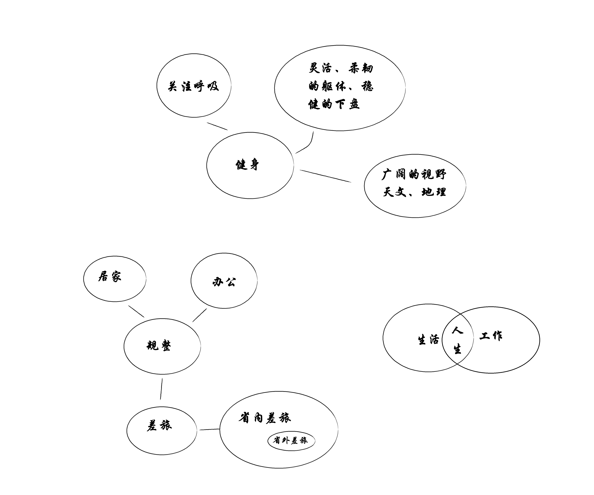

+++
date = '2026-04-28T16:33:51+08:00'
draft = false
title = 'Social Media Running'
+++

# 我的自媒体
三个原则： 真诚、 自然 、不刻意。  

从根本上来说，这三个词所表达的意思是一样的。  

这里我用分别用三个不同的词语表达同一个意思。  

一方面是为了强调重要性。另一方面也是为了体现我实现目的的三种方式。  

  
  ***真诚*** 是自我反思的需要
  
  ***自然*** 是流畅表达的需要 
  
  ***不刻意*** 是提高效率的需要
  
  
  